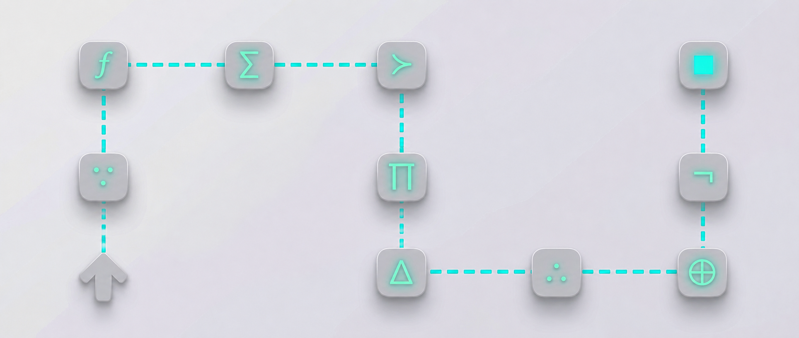

# Tesseract Stock Agent - Public Research Repository


This repository is the public research shelf for [Tesseract Research](https://www.researchtesseract.com), [Tesseract Stock Agent](https://www.researchtesseract.com/tesseractstockagent), and the workflow philosophy behind Tesseract Relay.

It is built and curated by [Benet Bani](https://www.linkedin.com/in/benetbani/). The goal is not to publish a cloneable product. The goal is to show the thinking: how structured prompt chains, same-chat continuation, browser-based LLM workflows, and disciplined research infrastructure can turn AI from a one-shot answer machine into a repeatable operating layer.



## What this repository contains

- A free Mini 5-Step Chain for public stock research practice.
- Editorial notes on why chain-based AI workflows matter.
- Sanitized engineering notes on Electron, browser automation, Playwright, CDP, and reliability limits.
- Public conceptual examples of completion markers and prompt-chain pacing.
- A catalog of workflow patterns that apply beyond finance.

This repository is intentionally source-available, not open source. It does not include the commercial Tesseract Relay app, the full Tesseract Stock Agent system, private workflow libraries, production selectors, packaging files, account-specific configuration, or anything that would make the paid product easy to recreate.

## Reading path

Start here if you are new to the system:

1. [Why chain-based AI workflows matter](essays/why-chain-based-ai-workflows-matter.md)
2. [Browser automation for AI workflows](essays/browser-automation-for-ai-workflows.md)
3. [Tesseract Relay system design](case-studies/tesseract-relay-system-design.md)
4. [Completion markers](concepts/completion-markers.md)
5. [Prompt-chain runner model](concepts/prompt-chain-runner-model.md)
6. [Workflow patterns](catalog/workflow-patterns.md)
7. [Applicability beyond finance](catalog/applicability-beyond-finance.md)
8. [Reliability boundaries](essays/reliability-boundaries.md)

## Finance was the proving ground

Tesseract Stock Agent began from a practical finance problem: serious equity research is not one question. It is a sequence.

First you need to understand the business. Then you need to understand the financial reality. Then valuation, expectations, risk, catalysts, adversarial counterarguments, and finally synthesis. If those steps are collapsed into one prompt, the model often produces language that sounds complete while skipping the actual research discipline.

That is why finance is a useful proving ground. It punishes vague reasoning. It exposes missing context. It forces the workflow to carry state from one stage to the next.

But the infrastructure is not finance-only. The same pattern applies anywhere AI work needs staged reasoning:

- Due diligence
- Market mapping
- Technical analysis
- Competitive research
- Compliance review
- Content operations
- Internal documentation
- Product strategy
- Long-form synthesis
- Multi-step decision support

The category is broader than stock analysis. It is structured AI workflow design.

## The free Mini 5-Step Chain

This is the public demonstration artifact. It is deliberately small. Use one ticker or company at a time. Replace `[TICKER]` with the company you want to analyze. Paste one step, wait for the answer, then paste the next step in the same conversation.

This is not investment advice, financial advice, or a recommendation to buy or sell securities.

### Step 1 - Business

```text
You are an equity research analyst. I am researching [TICKER].
Before any opinion on the stock, describe the business in plain terms:
what it sells, who pays, how it makes money, and the two or three things
that actually drive revenue. No valuation yet. No recommendation. Just the business.
```

### Step 2 - Financial health

```text
Using the business you just described, assess [TICKER]'s financial durability:
revenue trend, margins, cash generation, debt, and how the company behaves
in a downturn. Flag anything fragile. Still no price target.
```

### Step 3 - Valuation context

```text
Now place [TICKER] in valuation context. What multiples does it trade on,
how do those compare to its own history and its closest peers, and what
growth or margin assumptions are baked into today's price? State what the
market is implicitly assuming, not whether it is right.
```

### Step 4 - Catalysts and risks

```text
List the realistic catalysts that could re-rate [TICKER] up or down over
the next 12 months, and the failure modes that would break the thesis.
Rank them by how much they would actually move the stock, not by how likely
the news cycle is to mention them.
```

### Step 5 - One-page memo

```text
Synthesize everything above into a one-page research memo: the business in
two sentences, the financial verdict, the valuation read, the strongest bull
and bear case, and the single most important thing to watch. End with what
would have to be true for this to work, and what would have to be true for
it to fail. No buy/sell rating.
```

## How Tesseract Relay fits

[Tesseract Stock Agent](https://www.researchtesseract.com/tesseractstockagent) is the research system. Tesseract Relay is the local workflow helper that makes long same-chat prompt chains easier to run.

The operating idea is simple:

1. The user chooses a browser.
2. The user chooses an LLM provider.
3. The user loads a prompt pack.
4. The user enters the workflow input, such as a ticker, company name, document excerpt, or paragraph.
5. Tesseract Relay helps send the chain step by step in the same chat.

The same-chat part matters. A prompt chain loses value if each step starts from a blank context. Relay is designed around continuation: the output of step 1 becomes context for step 2, and so on.

This public repository explains the concept at a high level. It does not publish the production application.

## Engineering posture

Browser-based AI workflow automation is a messy engineering surface. It is not the same as calling a stable backend API. The automation has to live with changing provider pages, login states, streaming responses, long text insertion, accidental file attachment behavior, model latency, incomplete answers, and provider-specific UI differences.

That is why the engineering work is less about "send text to a page" and more about pacing, state, observability, failure recovery, and user control.

The public technical notes cover:

- Why Electron is useful for local workflow control.
- Why Playwright and CDP matter for connecting to a real user browser.
- Why completion markers are separated into human-readable and machine-readable lines.
- Why reliability has boundaries.
- Why local, user-visible automation is a better fit than hidden unattended execution for this class of workflow.

The private implementation contains more detail, but the public shape is enough to understand the system design tradeoffs.

## What this repository does not include

This repository does not include:

- Tesseract Relay source code.
- Production browser selectors.
- Desktop app packaging files.
- Signing material.
- Account-specific configuration.
- Paid prompt libraries.
- Regional workflow packs.
- Specialist commercial workflows.
- Internal handoff notes.
- Full retry logic.
- Full provider-specific fallback logic.

The examples are intentionally educational and incomplete.

## About the products

[Tesseract Research](https://www.researchtesseract.com) builds AI-assisted research systems for people who need structure, not generic chatbot output.

[Tesseract Stock Agent](https://www.researchtesseract.com/tesseractstockagent) is the flagship equity research product. It turns a ticker or company input into a staged research process, then into a structured investment memo.

Tesseract Relay is the local desktop helper for running same-chat prompt chains with more control, pacing, and visibility than manual copy-paste.

Founder: [Benet Bani](https://www.linkedin.com/in/benetbani/)

Website: [researchtesseract.com](https://www.researchtesseract.com)
